# Whisker 🐾

Whisker is a student MERN ecommerce prototype for pet products. The source includes catalogue, account, ordering, chat, and operations screens. It is not ready for real payments or fulfilment: the order path does not use a database transaction, and failure after a stock update can leave inventory inconsistent.

The server entry point is `server/index.js`. It requires MongoDB and credentials for enabled external integrations in environment variables; no live credentials are included. The client currently has dependency conflicts under a clean `npm ci`, so the screenshots below should be treated as a demonstration of the historical UI, not proof of a reproducible current build.

---

## ✅ Features

- Easy login and registration
- Product filtering and search (Cats/Dogs)
- Add favorites, view order history
- Multi-language support (English/Arabic)
- Admin panel to manage items and view stats
- Sales dashboard and detailed reports
- Vet consultation chat
- Customer support chat
- Packing and delivery system for orders

---

## 🖼️ Screenshots

> **Images**

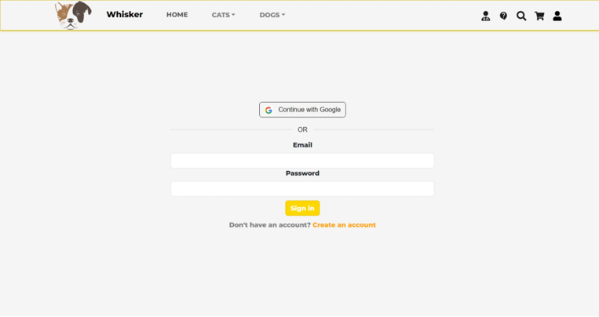  
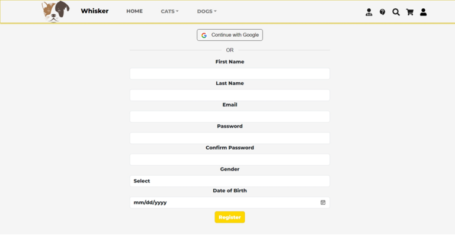  
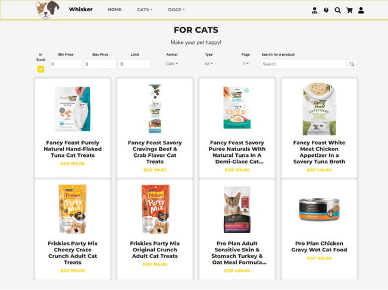  
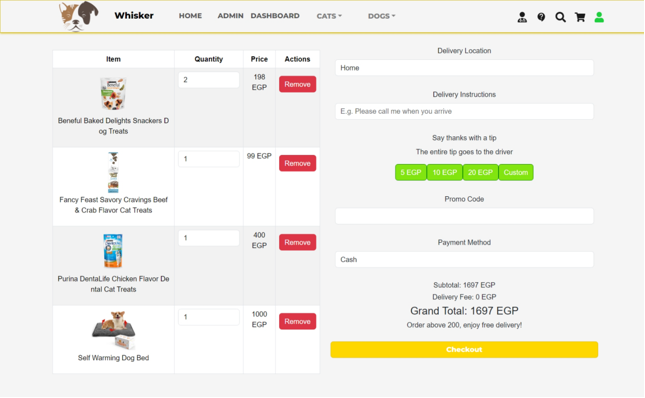  
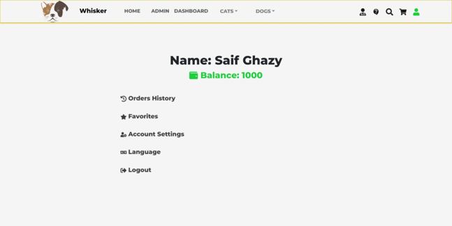  
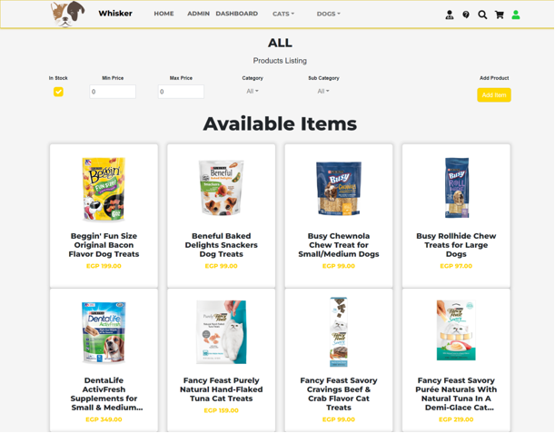  
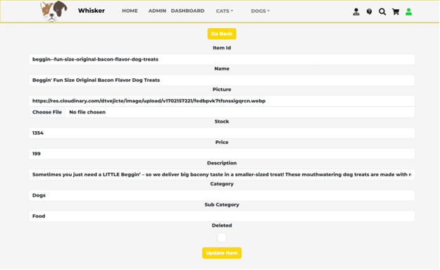  
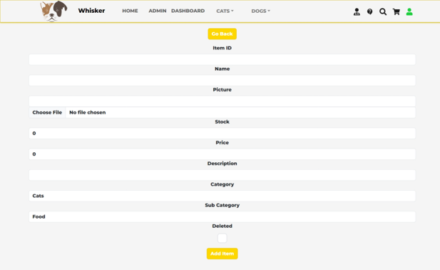  
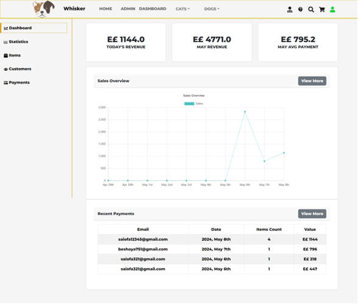  
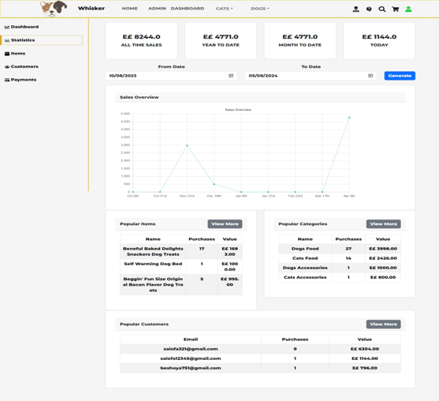  
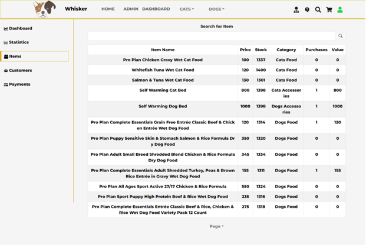  
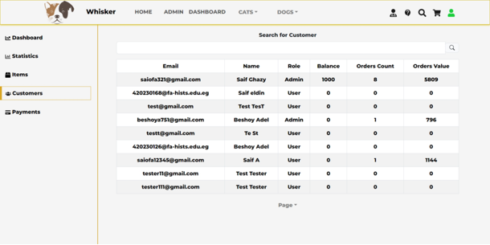  
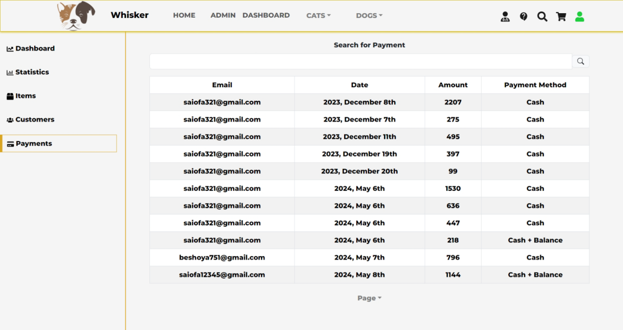  
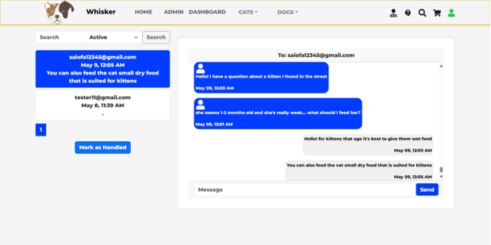  
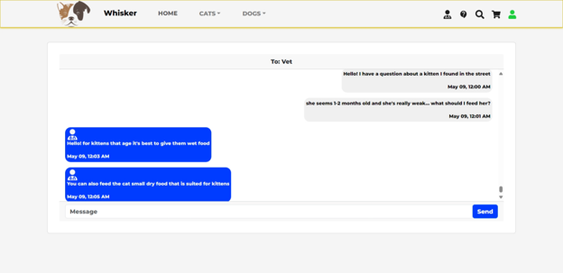  
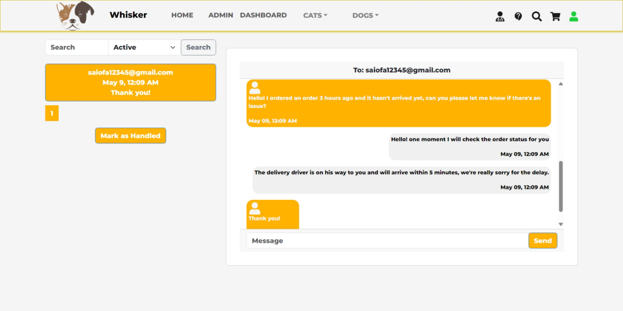  
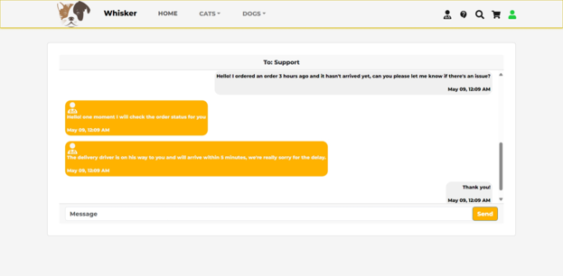  
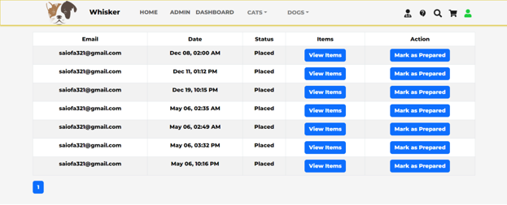  
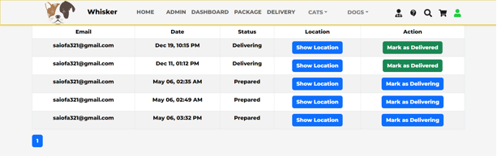

---

## 🛠️ Tech Stack

- **Frontend**: React.js  
- **Backend**: Node.js, Express.js
- **Database**: MongoDB  
- **Authentication**: Passport OAuth Strategy
- **Other Tools**: Chart.js, Bootstrap  

---
