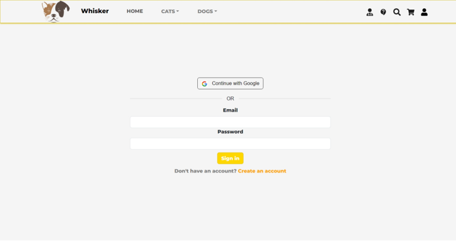
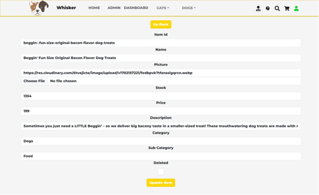
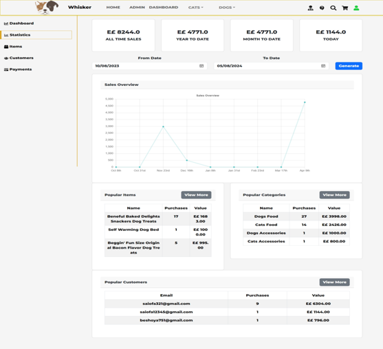
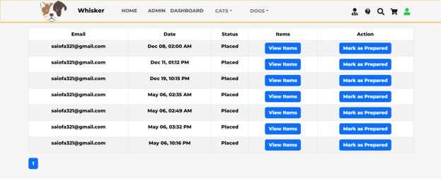

# Whisker 🐾

Whisker is an ecommerce website using the **MERN stack** for pet owners. It helps people buy pet food and accessories easily and have them delivered. It also offers automated vet chat support to answer questions about pets.

---

## ✅ Features

- Easy login and registration
- Product filtering and search (Cats/Dogs)
- Add favorites, view order history
- Multi-language support (English/Arabic)
- Admin panel to manage items and view stats
- Sales dashboard and detailed reports
- Vet consultation chat
- Customer support chat
- Packing and delivery system for orders

---

## 🖼️ Screenshots

> **Images**

  
  
  
  
  
  
  
  
  
  
  
  
  
  
  
  
  
  

---

## 🛠️ Tech Stack

- **Frontend**: React.js  
- **Backend**: Node.js, Express.js
- **Database**: MongoDB  
- **Authentication**: Passport OAuth Strategy
- **Other Tools**: Chart.js, Bootstrap  

---
